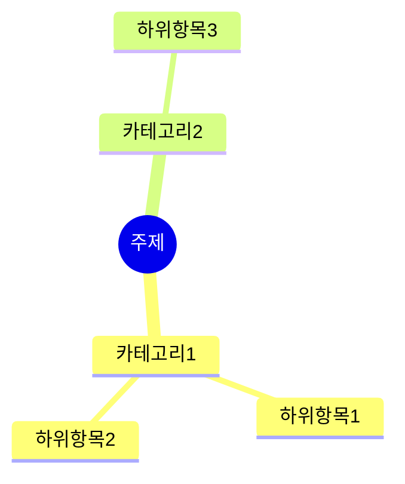

# Mindmap Summarizer for Obsidian

AI 기반 텍스트 요약 및 마인드맵 생성 플러그인입니다. 다양한 AI Provider를 지원하여 사용자가 원하는 모델을 선택할 수 있습니다.

## 주요 기능

- **AI 기반 텍스트 요약**: 긴 문서를 핵심 개념으로 요약
- **마인드맵 자동 생성**: 요약 내용을 시각적 마인드맵으로 변환
- **다양한 출력 형식 지원**:
  - Mermaid 다이어그램
  - Markdown 리스트
  - Markmap 형식
  - Obsidian Canvas

## 지원하는 AI Provider

### 1. OpenAI (GPT)
- GPT-4o, GPT-4o-mini, GPT-4-turbo, GPT-3.5-turbo

### 2. Anthropic (Claude)
- Claude 3.5 Sonnet, Claude 3.5 Haiku, Claude 3 Opus

### 3. Google (Gemini)
- Gemini 1.5 Pro, Gemini 1.5 Flash, Gemini 2.0 Flash

### 4. xAI (Grok)
- Grok-2-latest, Grok-2, Grok-beta

## 설치 방법

### 수동 설치
1. 최신 릴리스에서 `main.js`, `manifest.json`, `styles.css` 다운로드
2. Vault의 `.obsidian/plugins/mindmap-summarizer/` 폴더에 복사
3. Obsidian 재시작
4. 설정 > 커뮤니티 플러그인에서 활성화

### 개발 환경 설정
```bash
# 저장소 클론
git clone https://github.com/yourusername/obsidian-mindmap-summarizer.git

# 의존성 설치
npm install

# 개발 모드 실행 (감시 모드)
npm run dev

# 프로덕션 빌드
npm run build
```

## 사용 방법

### 명령어
1. **Generate mindmap from current note**: 현재 노트 전체를 마인드맵으로 변환
2. **Generate mindmap from selection**: 선택한 텍스트만 마인드맵으로 변환
3. **Generate and insert mindmap at cursor**: 커서 위치에 마인드맵 삽입

### 리본 아이콘
- 좌측 리본의 🧠 아이콘 클릭으로 현재 노트 마인드맵 생성

### 설정
1. 설정 > Mindmap Summarizer 이동
2. AI Provider 선택
3. API 키 입력 (클라우드 서비스의 경우)
4. 모델 선택
5. 출력 언어 설정

## 출력 형식

### Mermaid 다이어그램


### Markdown 리스트
```markdown
# 주제

## 카테고리1
  - 하위항목1
  - 하위항목2

## 카테고리2
  - 하위항목3
```

### Markmap 형식
Obsidian Markmap 플러그인과 호환되는 형식으로 생성됩니다.

### Canvas
Obsidian Canvas 형식의 시각적 마인드맵 파일(.canvas)로 생성됩니다.

## API 키 발급

### OpenAI
https://platform.openai.com/api-keys

### Anthropic
https://console.anthropic.com/settings/keys

### Google AI Studio
https://aistudio.google.com/app/apikey

### xAI (Grok)
https://console.x.ai/

## 라이선스

MIT License

## 기여

이슈 및 풀 리퀘스트 환영합니다!
